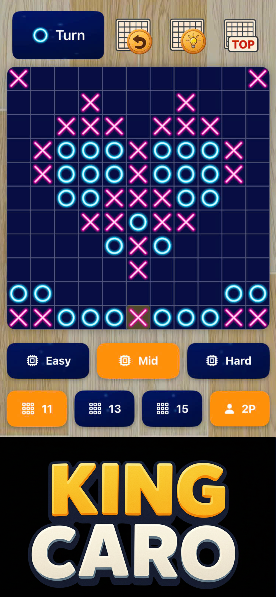

# 🏆 King Caro AI – Gomoku Offline

> **Fully Offline – No 4G/5G/WiFi Needed.**

---

## 🎮 Game Highlights

- 🆓 **Free to play** – Easy to use – No sign-up required.  
- ⚡ **Lightweight and fast** – Grandmaster-level AI.  
- ♻️ **Undo moves easily** to practice and improve.  
- 💡 **Move suggestions** help you learn quickly and boost your ELO.  
- 🧠 **Multiple AI levels:** Beginner – Player – Master.  

---

## 🏯 Classic Gomoku

Gomoku came to Japan around **270 BC** as *Kakugo*, meaning “five steps.”  
Over time, it became one of Japan’s favorite board games.  

**How to Play:** Place **X** or **O** and connect **5 in a row** to win!  
**Objective:** Win **50 matches on Hard mode (Master AI)** to earn the title **King Caro!**

---

## ⚙️ Optimized & Updated

- 📦 **Under 8MB** – Compact, smooth, and storage-friendly.  
- 🎵 **Intuitive interface** with lively sound effects.  
- 🏅 **ELO leaderboard** via Game Center.  

---

### 🧠 AI Strategy Logic

The AI follows a prioritized decision-making process to ensure optimal moves:

1. **If there’s a winning move (five in a row)** → play immediately.  
2. **If the opponent has a four** → block it immediately.  
3. **If the AI can create a four (including a 4×3 threat)** → play it.  
4. **Block the opponent’s open three.**  
5. **Block any opponent’s 4×3 threats.**  
6. **Block any opponent’s 3×3 threats.**  
7. **Otherwise**, use a **Alpha–Beta Search** to find the best move.

---

## 📸 Screenshots

|  |  |  |
|:--------------------------:|:--------------------------:|:--------------------------:|
| Game Board                | AI Match Mode             | Victory Screen             |

---

## 📱 About

**King Caro AI – Gomoku Offline** brings back the nostalgic school-time board game with modern AI.  
Challenge yourself anytime, anywhere — no connection required!

---

## 🚀 Coming Soon

🕒 *Available soon on the App Store!*  
While waiting for release, you can **visit my developer page on App Store:**  
👉 [https://apps.apple.com/us/developer/hai-nam-trinh/id1139152400](https://apps.apple.com/us/developer/hai-nam-trinh/id1139152400)

_(App Store link for this game will be added here once approved.)_

---

### 🔗 Follow & Support

⭐ Star this project on GitHub if you enjoy it!  
📩 Feedback and contributions are always welcome!
